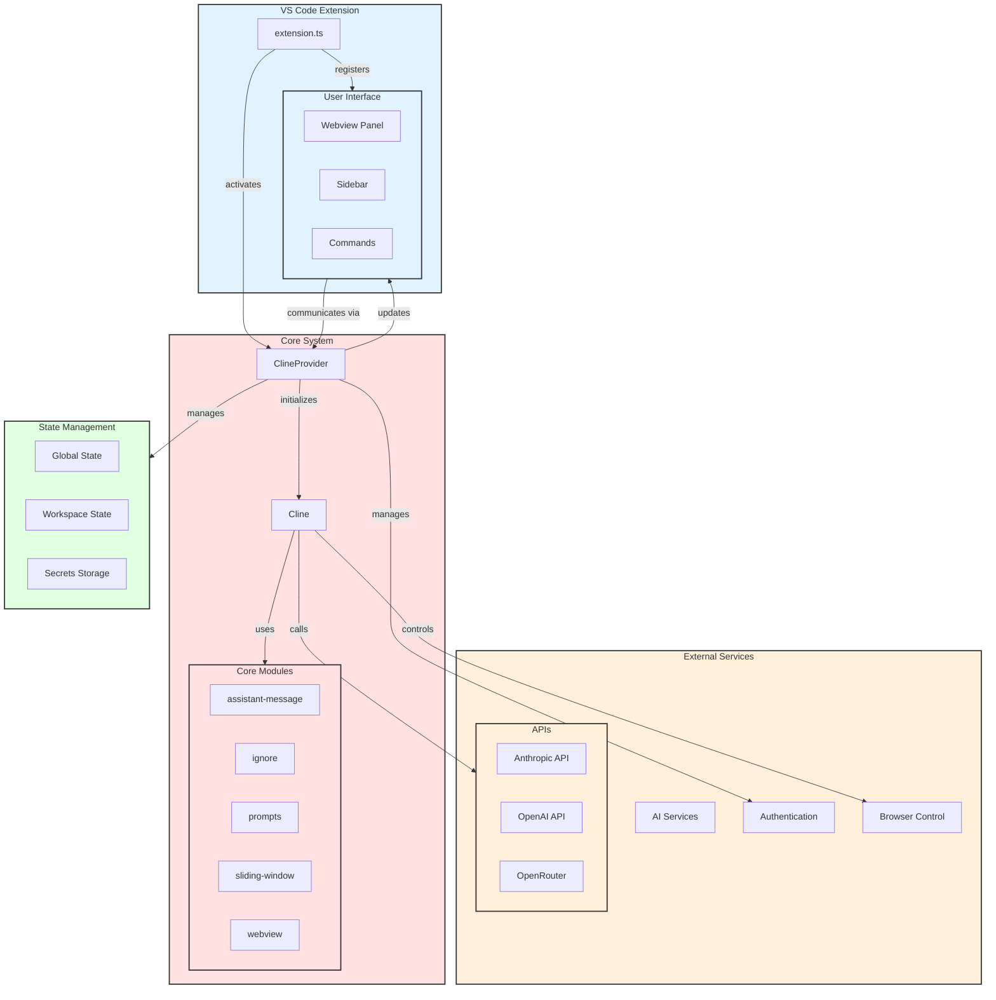
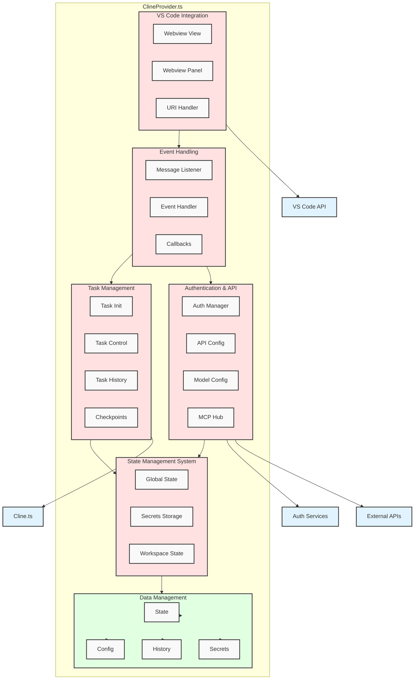
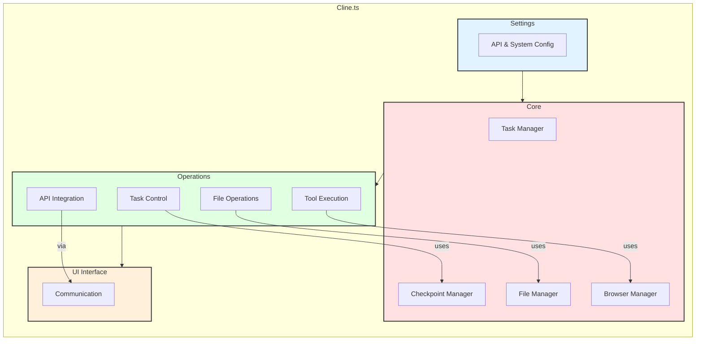
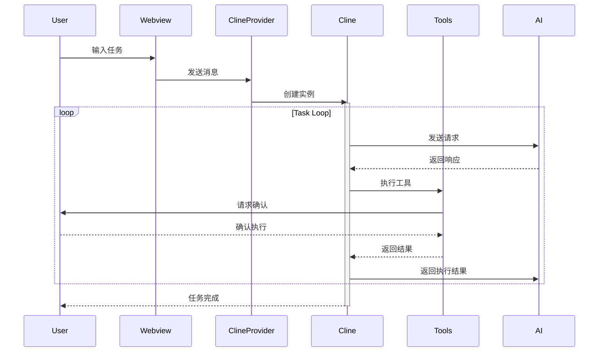
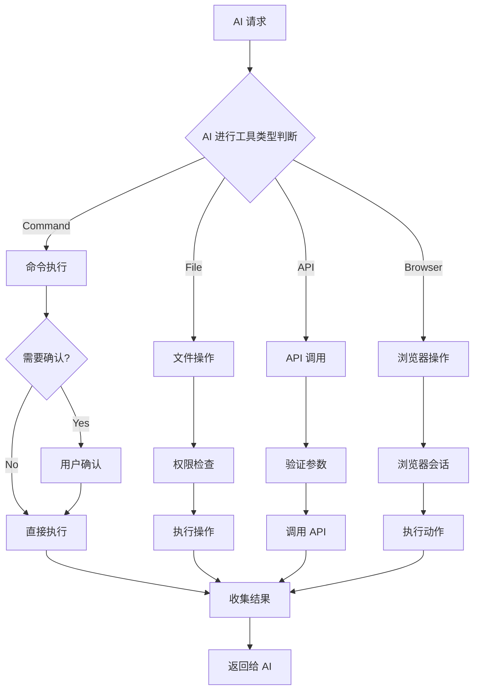

# Cline源码深度解析：AI驱动的VS Code智能助手架构与实现

> 以**提示词上下文管理**及**工具调用**为核心的工具。
查找参考内容用工具， MCP 是工具，操作文件的是工具，执行任务是工具。
> 

## 什么是Cline？

Cline 是一个基于 VS Code 的智能助手插件，它通过 AI 技术为开发者提供智能化的任务处理能力。在现代软件开发中，开发者经常需要在多个工具间切换，处理大量重复性工作，同时还要维持对代码和业务的深入理解。这不仅降低了开发效率，还增加了认知负担。

Cline 正是为解决这些问题而设计。它将 AI 能力与开发工具深度集成，提供了一个统一的智能化开发环境。通过智能理解开发者意图，自动化执行开发任务，并保持对项目上下文的持续理解，Cline 显著提升了开发效率和体验。

## 核心架构设计

Cline 插件采用模块化设计，主要由以下核心组件构成：

- ClineProvider：负责状态管理和 UI 交互
- Cline：核心业务逻辑处理
- 外部服务集成：包括 AI 服务、认证服务等
- 工具系统：提供文件操作、命令执行等能力

通过这些组件的协同工作，Cline 实现了四个核心目标：

1. **工具统一**
    - 在 VS Code 中集成文件操作、命令执行、浏览器控制等能力
    - 提供统一的界面来执行各种开发任务
    - 减少工具切换带来的认知负担
2. **智能自动化**
    - 通过 AI 理解开发者意图
    - 自动完成重复性工作
    - 智能化的代码理解和生成
3. **上下文保持**
    - 维护对项目结构的持续理解
    - 在任务执行过程中保持状态连贯
    - 支持长时间运行的复杂任务
4. **安全可控**
    - 提供操作确认机制
    - 支持任务的暂停和恢复
    - 实现关键操作的回滚能力

## 1. 整体架构概览

- **VS Code Extension Layer**
    - extension.ts: 插件入口点
    - 用户界面组件：
        - Webview Panel
        - Sidebar
        - Commands
- **Core System**
    - ClineProvider: 状态管理和视图控制
    - Cline: 核心业务逻辑
    - 核心模块：
        - assistant-message：消息处理
        - ignore：忽略规则
        - prompts：提示管理
        - sliding-window：对话管理
        - webview：UI 交互
- **State Management**
    - Global State：全局状态
    - Workspace State：工作区状态
    - Secrets Storage：密钥存储
- **External Services**
    - AI Services：
        - Anthropic API
        - OpenAI API
        - OpenRouter
    - Authentication：认证服务
    - Browser Control：浏览器控制

### 1.1 核心架构图



### 1.3 插件入口

```tsx
export function activate(context: vscode.ExtensionContext) {
    // 1. 创建输出通道
    outputChannel = vscode.window.createOutputChannel("Cline");

    // 2. 初始化日志系统
    Logger.initialize(outputChannel);

    // 3. 创建侧边栏提供者
    const sidebarProvider = new ClineProvider(context, outputChannel);

    // 4. 注册侧边栏视图
    context.subscriptions.push(
        vscode.window.registerWebviewViewProvider(
            ClineProvider.sideBarId,
            sidebarProvider,
            {
                webviewOptions: {
                    retainContextWhenHidden: true
                }
            }
        )
    );
}

// 注册了多个VS Code命令：
- "cline.plusButtonClicked" // 新建对话
- "cline.mcpButtonClicked"  // MCP按钮
- "cline.popoutButtonClicked" // 弹出到新标签页
- "cline.settingsButtonClicked" // 设置
- "cline.historyButtonClicked"  // 历史记录
- "cline.accountLoginClicked"   // 账号登录
```

### 1.4 ClineProvider.ts



### 1.5 cline.ts



### 1.6 提示词

分为几个部分：

1. 角色定义：定义角色信息
2. 工具调用：
    1. 工具定义
    2. 内置工具列表：
        1. 文件操作：读文件，写文件（覆盖），替换文件内容（diff形式），查文件，list 文件，list代码定义
        2. 浏览器操作：浏览器操作（使用 puppeteer访问和点击操作，执行操作并且返回截图和控制台日志）
        3. 终端操作：执行命令
        4. MCP 操作：MCP 工具调用和资源请求
        5. 基础操作：询问用户问题，输出命令结果（用于展示任务完成后的结果，标志结束）
        6. 规划模式：规划模式定义（帮助用户规划和脑暴解决方案）
    3. 调用例子和调用指南
3. MCP 服务：MCP 定义， 动态注入 MCP服务器列表，MCP 创建示例和指南
4. 替换文件和创建文件的区别：两者的定义和使用场景以及优势，考虑改写之后用户编辑器的自动格式化（直接输出最终状态），工作流程的一些建议
5. ACT模式和 PLAN 模式：让 AI 理解 act 模式和 plan 模式，act 模式可以调用除**plan_mode_response**工具之外的所有工具，而 plan 模式则使用**plan_mode_response**
6. 能力：指定 AI 具有什么能力，比如能调用哪些工具以及这些工具是干什么的
7. 规则：指定 AI 需要遵守的规则，能做什么，不能做什么
8. 系统信息：操作系统、默认 shell，home 目录，当前工作目录
9. 目标：宏观指定AI 完成任务的步骤
10. 用户自定义指南
源代码位置：https://github.com/cline/cline/blob/main/src/core/prompts/system.ts


## 2. 核心执行流程

### 2.1 任务执行流程

1. **任务初始化**
    - 用户通过 Webview 界面输入任务
    - Webview 将消息传递给 ClineProvider
    - ClineProvider 创建和初始化 Cline 实例
2. **任务执行循环**
    - Cline 向 AI 服务发送请求
    - AI 服务返回响应和可能的工具调用
    - Cline 解析响应并执行相应的工具
    - 需要用户确认的操作会请求用户确认
    - 工具执行结果返回给 Cline
    - Cline 将结果返回给 AI 服务继续处理
3. **任务完成**
    - 当所有必要的步骤都完成后
    - Cline 向用户返回最终结果
    - 任务执行完成



### 2.2 工具执行流程



## 3. 核心组件实现

### 3.1 ClineProvider Cline 核心类

```tsx
class ClineProvider implements vscode.WebviewViewProvider {
    private cline?: Cline
    private view?: vscode.WebviewView
    private context: vscode.ExtensionContext

    // 核心管理功能
    async initClineWithTask(task?: string)
    async handleMessage(message: Message)
    async updateState(state: State)
    
    // 定义全局文件名
		export const GlobalFileNames = {
			apiConversationHistory: "api_conversation_history.json", // API对话历史
			uiMessages: "ui_messages.json", // UI消息
			openRouterModels: "openrouter_models.json", // OpenRouter模型
			mcpSettings: "cline_mcp_settings.json", // MCP设置
			clineRules: ".clinerules", // Cline规则
		}
}
```

```tsx
class ClineProvider {
    constructor(context: vscode.ExtensionContext) {
        this.context = context
        this.cline = undefined  // 延迟初始化
    }

    async initClineWithTask(task?: string) {
        await this.clearTask()  // 清理现有任务

        // 获取配置
        const config = await this.getState()

        // 创建新实例
        this.cline = new Cline(
            this,
            config.apiConfiguration,
            config.autoApprovalSettings,
            config.browserSettings,
            config.chatSettings,
            config.customInstructions
        )
    }
}

```

```tsx
export class Cline {
    // 核心属性
    readonly taskId: string;
    api: ApiHandler;
    private terminalManager: TerminalManager;
    private urlContentFetcher: UrlContentFetcher;
    browserSession: BrowserSession;

    // 状态控制
    private didEditFile: boolean = false;
    private abort: boolean = false;
    private consecutiveMistakeCount: number = 0;

    // 历史记录
    apiConversationHistory: Anthropic.MessageParam[] = [];
    clineMessages: ClineMessage[] = [];

    // 配置系统
    autoApprovalSettings: AutoApprovalSettings;
    private browserSettings: BrowserSettings;
    private chatSettings: ChatSettings;

    // 任务执行核心方法
    async startTask(task?: string, images?: string[]): Promise<void> {
        // 初始化状态
        this.clineMessages = [];
        this.apiConversationHistory = [];

        // 更新界面
        await this.providerRef.deref()?.postStateToWebview();

        // 显示任务
        await this.say("text", task, images);

        // 标记初始化完成
        this.isInitialized = true;

        // 构建初始消息
        let imageBlocks = formatResponse.imageBlocks(images);

        // 启动任务循环
        await this.initiateTaskLoop(
            [{
                type: "text",
                text: `<task>\\n${task}\\n</task>`,
            },
            ...imageBlocks],
            true // isNewTask 标记
        );
    }
}

```

### 3.2 任务循环实现

```tsx
private async initiateTaskLoop(
    userContent: UserContent,
    isNewTask: boolean
): Promise<void> {
    let nextUserContent = userContent;
    let includeFileDetails = true;

    while (!this.abort) {
        // 核心请求处理
        const didEndLoop = await this.recursivelyMakeClineRequests(
            nextUserContent,
            includeFileDetails,
            isNewTask
        );

        includeFileDetails = false;

        if (didEndLoop) {
            break;
        } else {
            // 处理未使用工具的情况
            nextUserContent = [{
                type: "text",
                text: formatResponse.noToolsUsed(),
            }];
            this.consecutiveMistakeCount++;
        }
    }
}
```

### 3.3 任务结束的条件

```tsx
// 1. this.abort 为 true 的情况:
- 用户手动中止
- 发生严重错误
- Cline 实例被销毁

// 2. didEndLoop 为 true 的情况:
- 任务成功完成(使用 attempt_completion 工具)
- 达到最大错误次数
- 任务被标记为完成

// 3. 其他终止条件:
- 连续错误次数过多
- API 调用失败
- 工具执行失败

```

## 4. 请求处理系统

### 4.1 递归请求处理

```tsx
private async recursivelyMakeClineRequests(
    userContent: UserContent,
    includeFileDetails: boolean,
    isNewTask: boolean
): Promise<boolean> {
    // 1. 错误检查
    if (this.consecutiveMistakeCount >= MAX_CONSECUTIVE_MISTAKES) {
        throw new Error("Too many consecutive mistakes")
    }

    try {
        // 2. 准备消息
        const messages = this.prepareMessages(userContent, includeFileDetails)

        // 3. 发送 API 请求
        const response = await this.api.sendRequest(messages)

        // 4. 处理响应
        if (response.type === "completion") {
            return true  // 任务完成
        } else if (response.type === "tool_use") {
            await this.handleToolUse(response.tool)
            return false  // 继续执行
        }
    } catch (error) {
        this.handleError(error)
        return true
    }
}

```

### 4.2 消息准备

```tsx
private prepareMessages(
    userContent: UserContent,
    includeFileDetails: boolean
): MessageParam[] {
    // 1. 构建基础消息
    const messages = [...this.apiConversationHistory]

    // 2. 添加环境详情
    if (includeFileDetails) {
        messages.push({
            type: "environment_details",
            content: this.getEnvironmentDetails()
        })
    }

    // 3. 添加用户内容
    messages.push({
        type: "user_content",
        content: userContent
    })

    return messages
}

```

### 4.3 API 通信系统

```tsx
class ApiHandler {
    async *attemptApiRequest(previousApiReqIndex: number) {
        // 1. 系统提示准备
        let systemPrompt = await SYSTEM_PROMPT(
            cwd,
            this.api.getModel().info.supportsComputerUse,
            mcpHub,
            this.browserSettings
        );

        // 2. 上下文预处理
        const { truncatedHistory, deletedRange } = this.truncateHistoryToFitContext(
            previousApiReqIndex
        );

        // 3. 流式通信
        const stream = this.api.createMessage(systemPrompt, truncatedHistory);
        yield* this.handleStreamResponse(stream);
    }

    private truncateHistoryToFitContext(previousIndex: number) {
        const totalTokens = this.calculateTokensUsage();

        switch (this.contextWindow) {
            case 64_000: // deepseek models
                this.maxAllowedSize = this.contextWindow - 27_000;
                break;
            case 128_000: // most models
                this.maxAllowedSize = this.contextWindow - 30_000;
                break;
        }

        if (totalTokens >= this.maxAllowedSize) {
            return this.performTruncation();
        }

        return { truncatedHistory: this.history };
    }
}

```

### 4.4 工具

```tsx
export const toolUseNames = [
	"execute_command",
	"read_file",
	"write_to_file",
	"replace_in_file",
	"search_files",
	"list_files",
	"list_code_definition_names",
	"browser_action",
	"use_mcp_tool",
	"access_mcp_resource",
	"ask_followup_question",
	"plan_mode_response",
	"attempt_completion",
] as const
```

### 4.5 终端命令执行工具

```tsx
async executeCommandTool(command: string): Promise<[boolean, ToolResponse]> {
    // 1. 终端管理
    const terminalInfo = await this.terminalManager.getOrCreateTerminal(cwd)
    terminalInfo.terminal.show()

    // 2. 执行命令
    const process = this.terminalManager.runCommand(terminalInfo, command)

    // 3. 输出处理
    process.on("line", (line) => {
        result += line + "\\n"
        if (!didContinue) {
            sendCommandOutput(line)
        } else {
            this.say("command_output", line)
        }
    })

    // 4. 等待完成
    await process

    // 5. 返回结果
    return [completed, formatResult(result)]
}

```

### 4.6文件操作工具

```tsx
class FileOperations implements Tool {
    // 文件读取
    async readFile(path: string): Promise<string> {
        return fs.readFile(path, 'utf8');
    }

    // 文件写入
    async writeFile(path: string, content: string): Promise<void> {
        await this.ensureDirectoryExists(path);
        await fs.writeFile(path, content);
    }

    // 文件替换
    async replaceInFile(path: string, diff: string): Promise<void> {
        const content = await this.readFile(path);
        const newContent = await constructNewFileContent(diff, content);
        await this.writeFile(path, newContent);
    }

    // 文件列表
    async listFiles(path: string, recursive: boolean): Promise<string[]> {
        if (recursive) {
            return this.recursiveListFiles(path);
        }
        return fs.readdir(path);
    }
}

```

## 5. 安全机制实现

### 5.1 文件操作安全

```tsx
class FileOperationApproval {
    async checkFileAccess(operation: FileOperation): Promise<boolean> {
        // 1. 路径安全检查
        if (!this.isPathSafe(operation.path)) {
            return false;
        }

        // 2. 操作权限检查
        if (!this.hasPermission(operation.type)) {
            return false;
        }

        // 3. 内容安全检查
        if (operation.type === 'write' && !this.isContentSafe(operation.content)) {
            return false;
        }

        return true;
    }

    private isPathSafe(path: string): boolean {
        // 检查路径是否在工作目录内
        // 防止目录遍历攻击
        const normalizedPath = normalizePath(path);
        return isWithinWorkspace(normalizedPath);
    }
}

```

### 5.2 命令执行安全

```tsx
class CommandSecurity {
    private readonly restrictedCommands: Set<string> = new Set([
        'rm -rf',
        'format',
        'shutdown',
        // ... 其他危险命令
    ]);

    async validateCommand(command: string): Promise<boolean> {
        // 1. 检查是否是受限命令
        if (this.isRestrictedCommand(command)) {
            return false;
        }

        // 2. 检查命令权限
        if (!await this.checkCommandPermissions(command)) {
            return false;
        }

        // 3. 检查资源限制
        if (!this.checkResourceLimits(command)) {
            return false;
        }

        return true;
    }

    private isRestrictedCommand(command: string): boolean {
        return Array.from(this.restrictedCommands).some(
            restricted => command.includes(restricted)
        );
    }
}

```

### 5.3 检查点系统

三种情况：task（恢复任务消息）、workspace（恢复工作区文件）、taskAndWorkspace（同时恢复任务消息和工作区文件）

核心机制：ShadowGit（主仓库的变更不会影响到Shadow 仓库，shadow 仓库的变更会形成主仓库的**未提交的更改**）

核心流程：

1. 如果恢复 workspace 或 taskAndWorkspace，则会首先初始化 checkpointTracker，并通过 resetHead 直接将工作区恢复到指定 git commit。
2. 对于 task 或 taskAndWorkspace，我们还需要恢复 task 历史消息记录，同时记录回滚的 APi 资源消耗

```tsx
class CheckpointSystem {
    private checkpoints: Map<string, Checkpoint> = new Map();

    // 创建检查点
    async createCheckpoint(): Promise<string> {
        const checkpoint = {
            id: generateId(),
            timestamp: Date.now(),
            state: await this.captureCurrentState(),
            files: await this.captureFileState()
        };

        this.checkpoints.set(checkpoint.id, checkpoint);
        return checkpoint.id;
    }

    // 恢复检查点
    async restoreCheckpoint(id: string): Promise<void> {
        const checkpoint = this.checkpoints.get(id);
        if (!checkpoint) {
            throw new Error('Checkpoint not found');
        }

        await this.restoreState(checkpoint.state);
        await this.restoreFiles(checkpoint.files);
    }
}

```

## 6. 文件存储系统

文件存储主要分为以下几类：

Task对话流，配置文件（主要是 mcp服务器信息），mcp 服务端代码，自定义prompt（.clinerules）

**Task 存储**

~/Library/Application\ Support/Code/User/globalStorage/扩展名/tasks/任务ID

- api_conversation_history.json：存储消息和上下文
    
 
- ui_messages.json：存储 UI 上显示的信息
    
 
- checkpoints：检查点信息
    - .git：存储记录检查点的影子仓库数据

**配置信息存储**

~/Library/Application\ Support/Code/User/globalStorage/扩展名/settings

- cline_mcp_settings.json：存储 mcp 的信息，包括ID、参数，环境变量等信息
    
**mcp服务端代码存储位置**

- ~/Documents/Cline/MCP：这个文件夹存储 mcp 服务器的代码位置

## 7. 技术细节与实现要点

TreeSitter：使用 web-tree-sitter 进行代码文件的解析和提取

## 总结与学习收获

通过深入分析Cline的源码架构，我们可以总结出以下几个关键要点：

### 核心设计理念
1. **模块化架构**：清晰的组件分离，便于维护和扩展
2. **工具统一**：通过统一的工具调用接口，简化开发流程
3. **上下文保持**：智能的对话管理和状态维护
4. **安全可控**：完善的安全机制和检查点系统

### 技术实现亮点
1. **递归任务循环**：优雅的任务执行流程设计
2. **流式API通信**：高效的AI服务集成
3. **MCP协议支持**：标准化的工具调用协议
4. **ShadowGit机制**：创新的检查点恢复方案

### 学习价值
- **VS Code插件开发**：了解大型插件的架构设计
- **AI工具集成**：学习如何将AI能力集成到开发工具中
- **系统安全设计**：理解复杂系统的安全机制实现
- **状态管理**：掌握复杂应用的状态管理策略

Cline的成功实现为AI驱动的开发工具提供了很好的参考，其架构设计和技术选型都值得深入学习和借鉴。