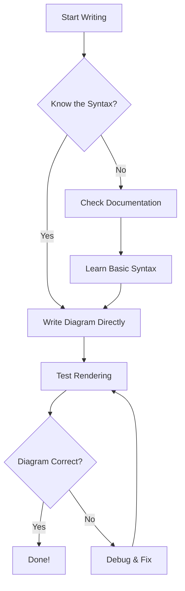
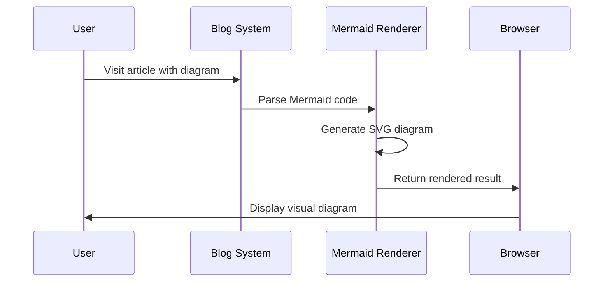
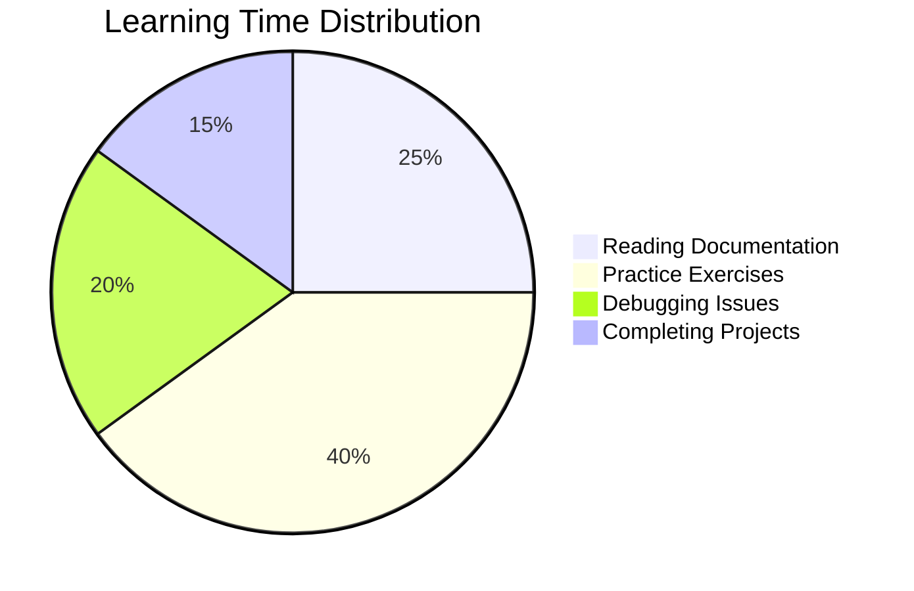
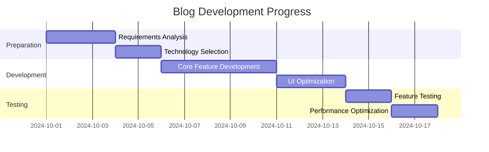
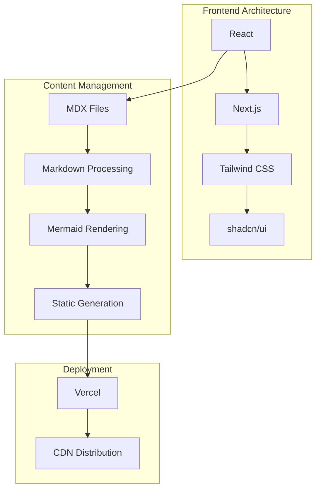

# Mermaid Quick Start Guide

Mermaid is a powerful diagram generation tool that lets you create various types of visual diagrams using simple text syntax. This tutorial will help you quickly master using Mermaid in your blog.

## 🚀 Basic Syntax

Mermaid uses concise text syntax to define diagram structures. Each diagram type has its own syntax rules, but the basic concepts are consistent.

## 📊 Flowchart

Flowcharts show steps and decision processes:

## ⏱️ Sequence Diagram

Sequence diagrams show the interaction order between different components or users:

## 🥧 Pie Chart

Pie charts show proportional relationships in data:

## 📈 Gantt Chart

Gantt charts are used for project progress management:

## 🏗️ Architecture Diagram (Graph)

Architecture diagrams show system structure:

## 💡 Usage Tips

### 1. Choose the Right Diagram Type
- **Flowchart**: Best for showing decision flows and algorithm steps
- **Sequence Diagram**: Best for showing interaction processes and time sequences
- **Pie Chart**: Best for showing proportions and percentage data
- **Gantt Chart**: Best for project timeline management
- **Architecture Diagram**: Best for showing system structure and relationships

### 2. Syntax Key Points
- Use meaningful node names
- Use connector arrow directions appropriately
- Add subgraphs to organize complex structures
- Use comments to explain complex logic

### 3. Common Issues
- **Syntax Errors**: Check if brackets and quotes match
- **Messy Layout**: Use different layout directions (TD, LR, TB, RL)
- **Overlapping Nodes**: Increase node spacing or adjust layout

## 🎯 Best Practices

1. **Start Simple**: Create basic diagrams first, then gradually add details
2. **Test Rendering**: Frequently check if the diagram displays correctly
3. **Add Comments**: Use comments to explain complex logic structures
4. **Keep It Clean**: Organize nodes and connections layout appropriately

## 🔄 Compatibility Notes

Our blog system supports:
- ✅ All mainstream Mermaid diagram types
- ✅ Automatic adaptation for dark/light themes
- ✅ Responsive design, mobile-friendly
- ✅ Error handling and user-friendly prompts

Now you can easily create professional diagrams in your blog posts! Start creating your first Mermaid diagram!
