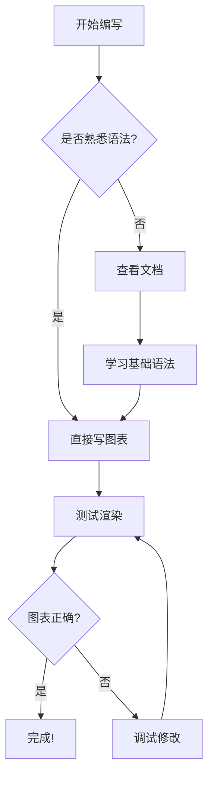
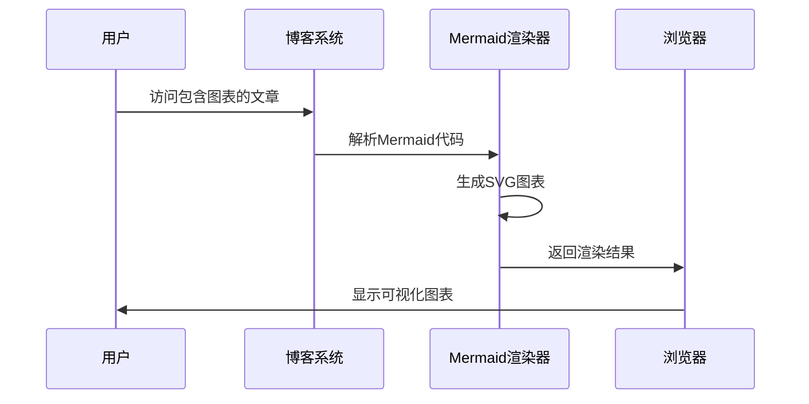
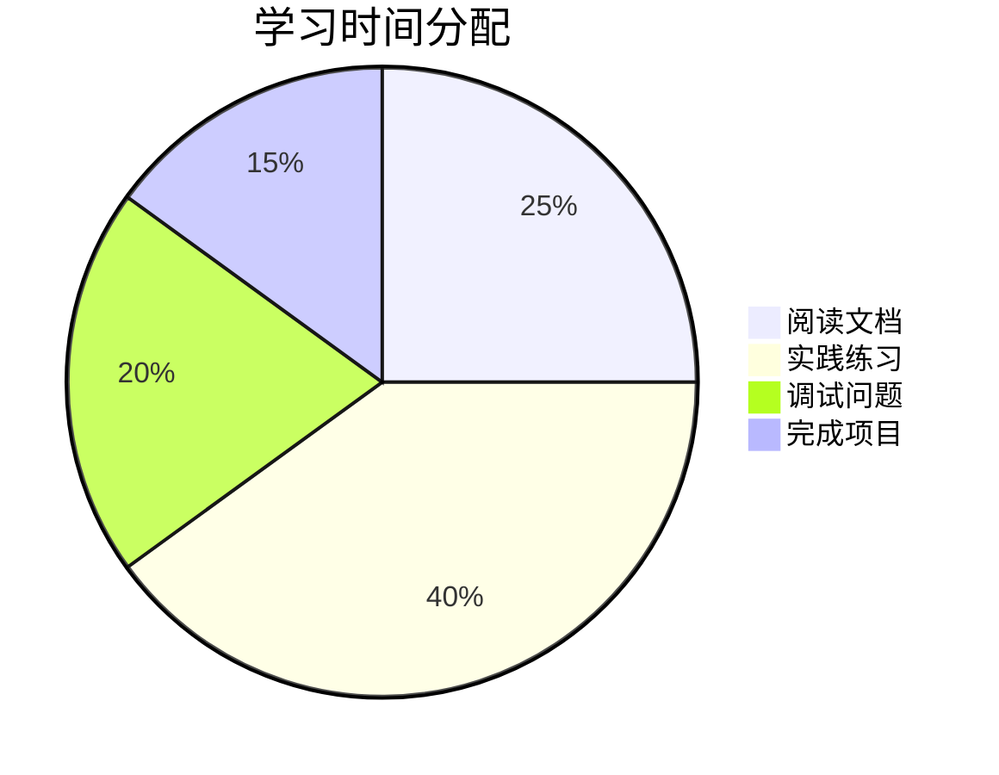
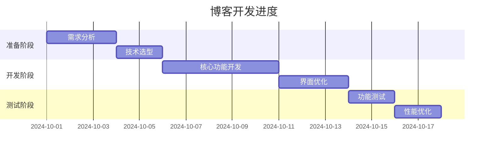
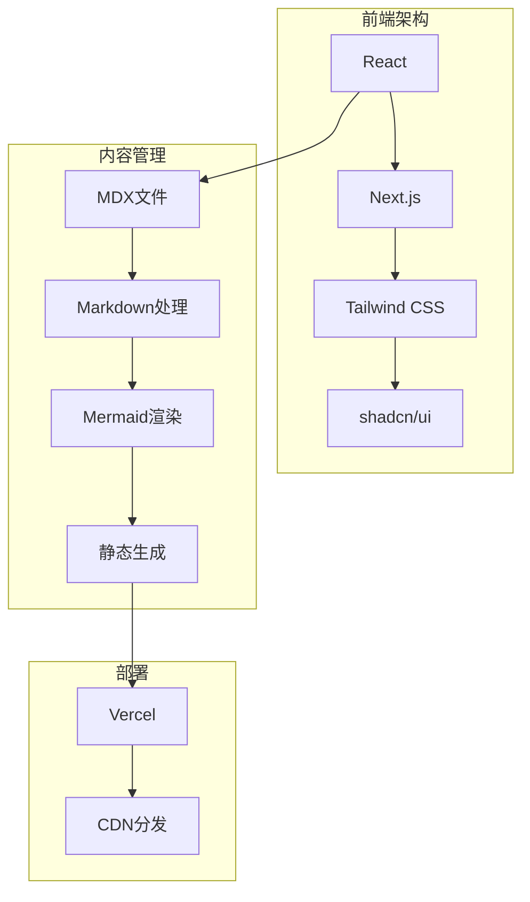

# Mermaid 快速上手指南

Mermaid 是一个强大的图表生成工具，可以通过简单的文本语法创建各种类型的可视化图表。本教程将帮助你快速掌握在博客中使用 Mermaid 的技巧。

## 🚀 基础语法

Mermaid 使用简洁的文本语法来定义图表结构。每个图表类型都有自己的语法规则，但基本概念相通。

## 📊 流程图 (Flowchart)

流程图用于展示步骤和决策过程：

## ⏱️ 时序图 (Sequence Diagram)

时序图用于展示不同组件或用户之间的交互顺序：

## 🥧 饼图 (Pie Chart)

饼图用于展示数据的比例关系：

## 📈 甘特图 (Gantt Chart)

甘特图用于项目进度管理：

## 🏗️ 架构图 (Graph)

架构图用于展示系统结构：

## 💡 使用技巧

### 1. 选择合适的图表类型
- **流程图**：适合展示决策流程和算法步骤
- **时序图**：适合展示交互过程和时间顺序
- **饼图**：适合展示比例和百分比数据
- **甘特图**：适合项目时间线管理
- **架构图**：适合展示系统结构和关系

### 2. 语法要点
- 使用有意义的节点名称
- 合理使用连接器的箭头方向
- 添加子图表来组织复杂结构
- 使用注释来解释复杂逻辑

### 3. 常见问题
- **语法错误**：检查括号和引号是否匹配
- **布局混乱**：使用不同的布局方向 (TD, LR, TB, RL)
- **节点重叠**：增加节点间距或调整布局

## 🎯 最佳实践

1. **从简单开始**：先创建基础图表，再逐步添加细节
2. **测试渲染**：经常检查图表是否正确显示
3. **添加注释**：用注释解释复杂的逻辑结构
4. **保持整洁**：合理组织节点和连线的布局

## 🔄 兼容性说明

我们的博客系统支持：
- ✅ 所有主流 Mermaid 图表类型
- ✅ 自动适配深色/浅色主题
- ✅ 响应式设计，适配移动端
- ✅ 错误处理和友好提示

现在你可以在博客文章中轻松创建专业的图表了！开始尝试创建你的第一个 Mermaid 图表吧！